# Smart Campus Emergency Response System

```mermaid
flowchart LR
    user([Students, staff, administrators])

    subgraph frontend[Frontend: static HTML/CSS/JavaScript]
        pages[Pages: home, login, dashboard, alerts, SOS, shelters, map, reports]
        components[Shared components: navbar, sidebar, footer]
        api[frontend/js/api.js\nJWT in localStorage]
        pages --> components
        pages --> api
    end

    subgraph backend[Backend: FastAPI application]
        app[app/main.py\napplication + lifespan]
        middleware[CORS, auth middleware, error handlers]
        routes[API routers\n/auth /users /incidents /alerts /sos\n/shelters /prediction /chatbot /image-analysis]
        services[Services\nauth, incidents, alerts, SOS, notifications]
        models[Models and schemas\nusers, incidents, alerts, shelters, SOS]
        integrations[Integrations\nAI, maps, notifications, shelter helpers]
        app --> middleware --> routes
        routes --> services
        services --> models
        services --> integrations
    end

    firestore[(Firebase Firestore)]
    firebase[Firebase Admin SDK\nservice-account credentials]
    ai[AI providers\nchatbot, prediction, image analysis]
    maps[Maps/geolocation services]
    notify[Notification channels]

    user -->|HTTP| frontend
    api -->|JSON + Bearer JWT\nhttp://127.0.0.1:8000| backend
    firebase --> firestore
    services -->|repositories| firebase
    integrations --> ai
    integrations --> maps
    integrations --> notify

    classDef client fill:#e7f5f2,stroke:#147d72,color:#123b37
    classDef server fill:#fff3d6,stroke:#b7791f,color:#4a2b08
    classDef data fill:#e8eef9,stroke:#4169a1,color:#172b4d
    classDef external fill:#f8e6e6,stroke:#a33a3a,color:#4a1616
    class pages,components,api client
    class app,middleware,routes,services,models,integrations server
    class firestore,firebase data
    class ai,maps,notify external
```

## Runtime topology

- `run.ps1` starts the FastAPI backend on `http://127.0.0.1:8000`.
- `run.ps1` serves the static `frontend` directory on `http://127.0.0.1:5500`.
- Firebase Firestore is managed externally; there is no local database process in this repository.
- The backend imports Firebase credentials during application startup. Keep the service-account JSON under `backend/credentials/` and do not expose it through the frontend.